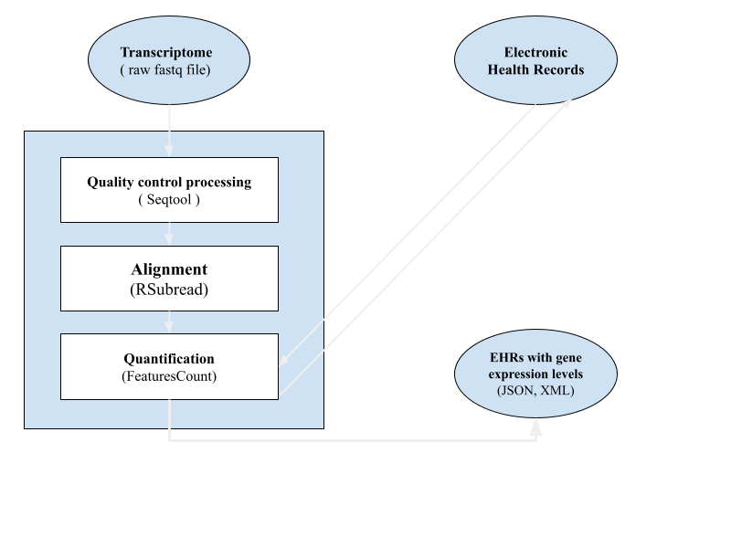

# Integrating-Omics-Data-in-Medical-Records

## Participants
* Abdellah IDRISSI AZAMI.
* Nihal HABIB.
* Abdesselam BOUGDIRA.
* Mustapha LEMSEYAH.
* Douae EL GHOUBALI.
* Hédia TNANI.
### How to cite:

## Background
 Omics data provide a comprehensive amount of molecular profiles from biological samples (e.g. Genomics, Epigenomics, Transcriptomics, Proteomics, Metabolomics …). EHR or electronic health records are digital records of health information alongside personal information (age, ethnicity, gender, …).

 ## What is the problem ? 
As omics technologies become more widely used in the clinical environment, integrating omics data within EHRs will become increasingly important for interpretation and clinical decision support. 
However, it has been a challenge to both add the omics data into the EHRs, due to their  and provide easily interpretable results that could be used by clinicians.

## Why fix it ?
Integrative multi-omic data analysis is of growing importance because it provides a holistic view of molecular fingerprints for each patient’s condition.

This project aims to provide an easily manageable database to store both patient’s EHRs and -omics data and provide clinicians with readable and easily interpretable output that helps them in the process of decision taking.

### Case study
As a start, and due to time constraint, we will be focusing on integrating transcriptomic data first into our project.

### Workflow diagram

### How to use it

## Planned features
Incorporate more Omics data into our tool
Use Artificial Intelligence to provide more in depth analysis with detailed output.

## Team
* Abdellah IDRISSI AZAMI, PhD candidate, idrissi.azami.abdellah@gmail.com, UM6SS, Casablanca, Morocco.
* Nihal HABIB, PhD candidate, nhlhabib98@gmail.com, UM6SS, Casablanca, Morocco.
* Abdesselam BOUGDIRA, PhD candidate, abdesselam.bougdira@usmba.ac, USMBA, Fes, Morocco.
* Mustapha LEMSEYAH, Engineering student, mustapha.lemsyah@gmail.com, Hitech, Rabat, Morocco.
* Douae EL GHOUBALI, PhD candidate, douae1231@gmail.com, UM6SS, Casablanca, Morocco. 
* Hédia TNANI, PhD, hediatnani0@gmail.com, Pasteur Institut, Tunisia.
